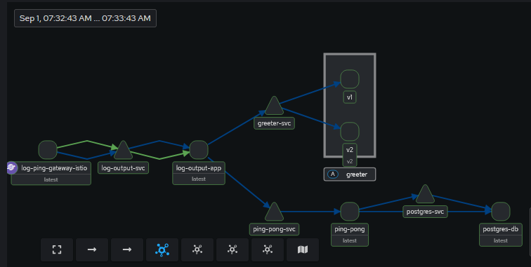
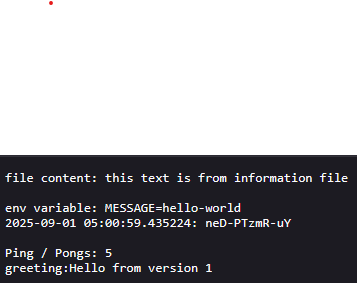
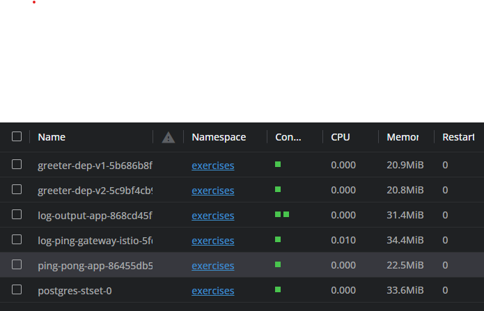

# Log-Output application deployed to Service Mesh

> [!NOTE]
> - The application `log-output` and `ping-pong` are taken from the [main submission repo](https://github.com/aritrabiswas2004/devops-with-kubernetes).

## Screenshots

### Kiali



### Output of `log-output` application



### Lens



## Deployment Instructions

### Istio Setup

Istio is required to deploy into the service mesh

1. Follow according to [docs for `k3d`](https://istio.io/latest/docs/ambient/install/platform-prerequisites/#k3d)

2. Install the [Gateway API CRDs](https://istio.io/latest/docs/ambient/getting-started/#install-the-kubernetes-gateway-api-crds)

### Deploying the Application

1. Deploy the `ping-pong` app using

```shell
kubectl apply -f ping-pong/manifests
```

2. Deploy the `greeter` app using

```shell
kubectl apply -f greeter/manifests

3. Deploy the `log-output` app using

```shell
kubectl apply -f ping-pong/volumes # yes its in ping-pong directory... pls don't judge
kubectl apply -f log-output/manifests
```

